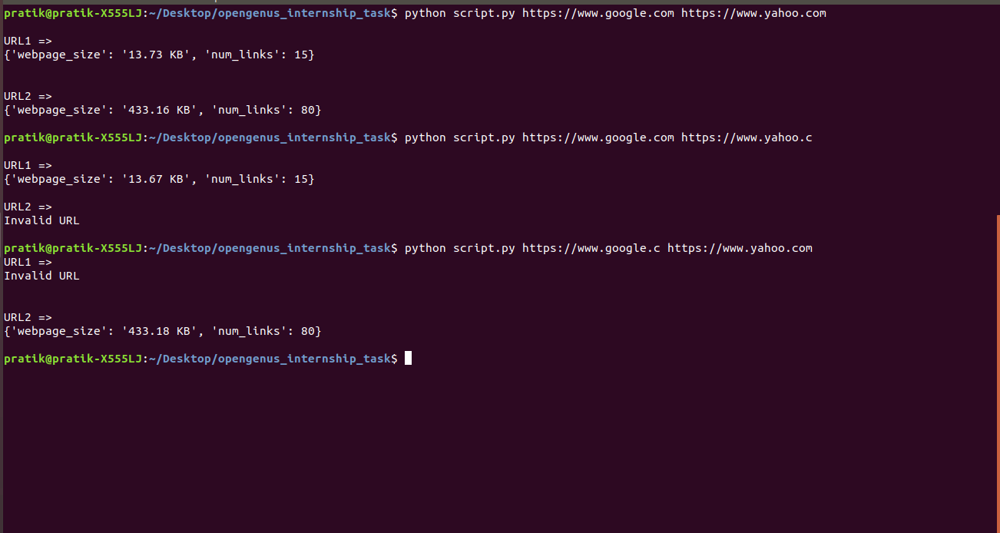
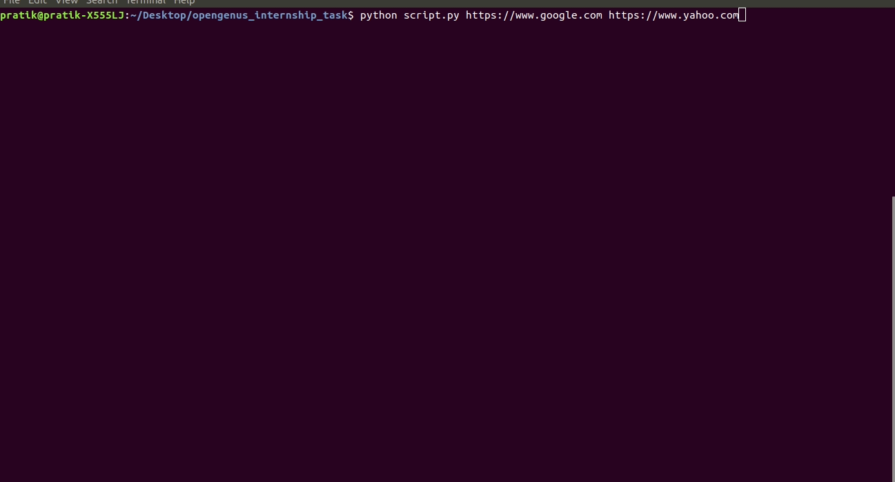

## Usage

### Installing packages and dependencies

```
#Install BeautifulSoup
sudo apt-get install python-beautifulsoup

#Install requests
sudo apt-get install python-requests

#Install humanfriendly
sudo apt-get install python-humanfriendly
```
### Run script

```
$ python script.py <url1> <url2> ...
```
## Example

```
$ python script.py https://www.google.com

URL1 =>
{'webpage_size': '244.39 KB', 'num_links': 54}
```
```
$ python script.py https://yahoo.com https://ww.google.ccc https://www.google.com

URL1 =>
{'webpage_size': '433.79 KB', 'num_links': 82}

URL2 =>
Invalid URL


URL3 =>
{'webpage_size': '13.75 KB', 'num_links': 15}

```
## Media




